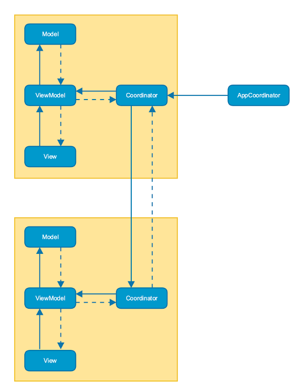
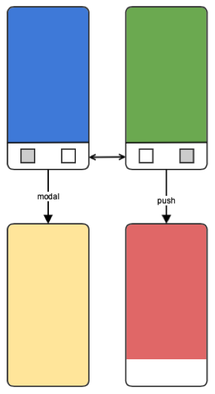

## Atlas

[](https://dmtech.de/)

> Atlas is a framework that helps you structure your tab bar based iOS app using the MVVM-C architecture pattern.


### Features

* Separation of concerns
* Avoid boilerplate code and never write coordinators again
* Enforce the MVVM architecture pattern

The Atlas framework is based on the concepts introduced in the [MVVM-C talk by Steve Scott](https://www.youtube.com/watch?v=9VojuJpUuE8).



## Getting Started

### Installation

Add the following to your Cartfile:

```github "dm-drogeriemarkt/Atlas" ~> 1.1.0```

or use the framework via CocoaPods:
``` pod 'AtlasFramework', '1.1.0' ```

### Configuration

Create your model and let it conform to MVVMCModelProtocol.
In your AppDelegate, create the AppCoordinator and keep a reference to it.

```    
func application(_ application: UIApplication, didFinishLaunchingWithOptions launchOptions: [UIApplication.LaunchOptionsKey: Any]?) -> Bool {
        window = UIWindow(frame: UIScreen.main.bounds)
        window?.makeKeyAndVisible()

        let model = DemoModel()
        appCoordinator = MVVMCAppCoordinator(model: model, window: window!, factories: [BlueFactory(), GreenFactory()])
        appCoordinator.start()

        return true
    }
```

For every module in your app, create a factory that conforms to `MVVMCTabBarFactoryProtocol` if it should appear as tab within the tab bar or `MVVMCFactoryProtocol` otherwise.

The factory must implement the `createView` method to return the specific view for the module. This is the place where you want to create your view model as well. A reference to the applications model is passed into `createView`.

If you want to create a view container that needs to be recreated when some conditions change, implement the `update` method. To trigger the update, call `requestUpdate` on the coordinator.

Each factory must decide how its view will be presented by specifying the `transitionType`. Currently, `modal` and `push` are supported.

Another requirement for each factory is that it must know to which modules it can navigate. This is done by implementing the `target` method, where an identifier is given and the matching factory must be returned.

All modules that act as a navigation target should be defined in an enum that conforms to `MVVMCNavigationTarget`.

## Demo App

The demo app consists of a tab bar with two screens, blue and green. 

The blue screen demonstrates how to present another screen modally.
The yellow screen displays some data from the model that changes over time. This is an example how to listen to changes in the model and reflect them in the view model and view.
The green and red screens show how to pass data from one screen to another.


